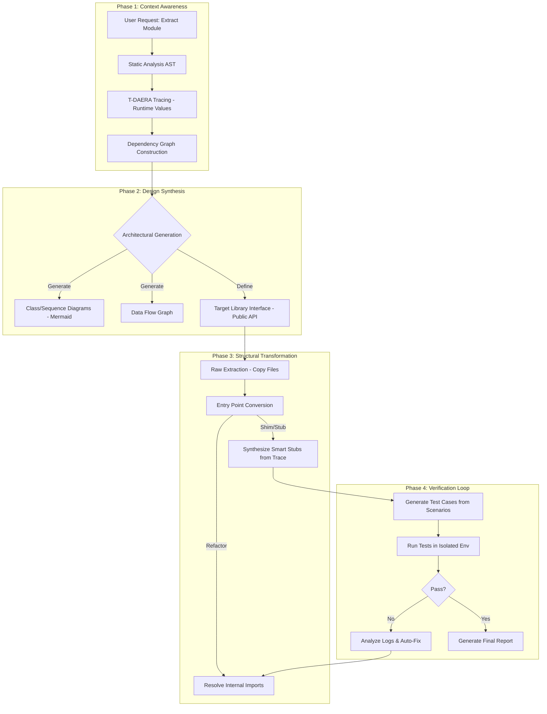
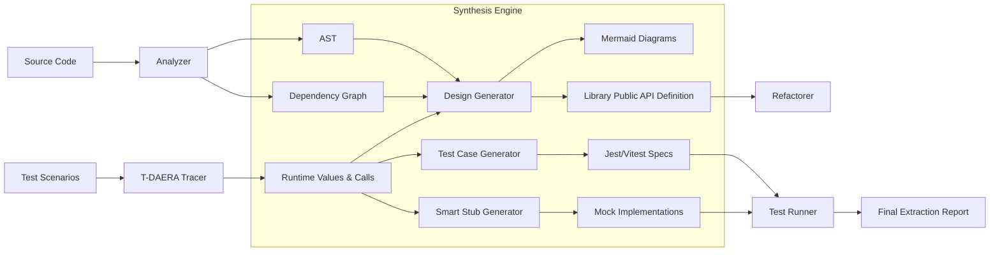

# Analysis Agent Architecture Documentation

## v3.0 Enhancement: Design-Driven Closed-Loop Refactoring

This architecture now includes **v3.0 Design-Driven Closed-Loop Refactoring**, which builds upon T-DAERA to add:

### v3.0 Key Benefits

1. **Architecture First**: Generates Mermaid diagrams before extraction - class diagrams, dependency graphs, data flow
2. **Entry-First Strategy**: Defines public API before refactoring, ensuring all changes support the interface
3. **Test Generation**: Creates Jest/Vitest tests automatically from trace data
4. **Iterative Fix Loop**: Automatically fixes build errors by adding files or generating stubs
5. **Closed-Loop Verification**: Re-runs scenarios to verify extracted library matches original behavior

### v3.0 CLI Options

```bash
analysis-agent extract -p <project> -m "module" --design-driven    # Enable v3.0
  --no-diagrams        # Skip architecture diagram generation
  --no-tests           # Skip test generation from trace data  
  --no-fix-loop        # Skip iterative fix loop
  --max-fix-iterations <n>  # Max fix iterations (default: 10)
  --auto-fix-mode <mode>    # import, stub, or both (default: both)
```

### v3.0 Process Flow



### v3.0 Data Flow



---

## T-DAERA Enhancement (v2.0)

This architecture now includes **T-DAERA (Trace-Driven Automated Extraction & Refactoring Architecture)**, which adds dynamic tracing capabilities for generating smart stubs with actual runtime values.

### T-DAERA Key Benefits

1. **Smart Stubs**: Generated stubs contain actual recorded return values, not just "throw Error"
2. **Behavior Recording**: Captures real I/O mappings during test execution
3. **Precision Pruning**: Only includes methods that were actually called
4. **Verification**: Re-runs scenarios in new environment to validate extraction

### T-DAERA CLI Options

```bash
analysis-agent extract -p <project> -m "module" --trace    # Enable tracing
  --scenario <path>     # Custom test scenario file
  --trace-timeout <ms>  # Timeout for tracing (default: 30000)
  --spy-modules <mods>  # Specific modules to spy on
  --verify              # Verify after extraction
```

---

## 1. System Architecture Overview

```
┌─────────────────────────────────────────────────────────────────────────────┐
│                           CLI Entry Point                                   │
│                              (cli.ts)                                       │
│  ┌─────────────┐  ┌─────────────┐  ┌─────────────┐  ┌─────────────────────┐ │
│  │ -p project  │  │ -m module   │  │ -e entry    │  │ -f focus / --depth  │ │
│  └─────────────┘  └─────────────┘  └─────────────┘  └─────────────────────┘ │
│  ┌─────────────┐  ┌─────────────┐  ┌─────────────┐  ┌─────────────────────┐ │
│  │  --trace    │  │ --scenario  │  │  --verify   │  │ T-DAERA Options     │ │
│  └─────────────┘  └─────────────┘  └─────────────┘  └─────────────────────┘ │
└─────────────────────────────────────────────────────────────────────────────┘
                                      │
                                      ▼
┌─────────────────────────────────────────────────────────────────────────────┐
│                         Analysis Agent (agent.ts)                           │
│  ┌────────────────────────────────────────────────────────────────────────┐ │
│  │                         AnalysisAgent Class                            │ │
│  │  ┌──────────────────┐    ┌──────────────────┐    ┌──────────────────┐  │ │
│  │  │     Logger       │    │   AgentConfig    │    │  SkillContext    │  │ │
│  │  │   (logger.ts)    │    │  (model, temp)   │    │ (+ traceLog)     │  │ │
│  │  └──────────────────┘    └──────────────────┘    └──────────────────┘  │ │
│  └────────────────────────────────────────────────────────────────────────┘ │
└─────────────────────────────────────────────────────────────────────────────┘
                                      │
                    ┌─────────────────┴─────────────────┐
                    ▼                                   ▼
┌───────────────────────────────┐   ┌───────────────────────────────────────┐
│    Copilot SDK Execution      │   │       Direct Skill Execution          │
│   (runWithCopilotSDK)         │   │     (runDirectExecution)              │
│  ┌─────────────────────────┐  │   │                                       │
│  │  CopilotClient          │  │   │   Sequential skill calls:             │
│  │  CopilotSession         │  │   │   1. analyzeProjectDependencies       │
│  │  Tool Definitions       │  │   │   1.5 [T-DAERA] runTracing            │
│  └─────────────────────────┘  │   │   2. extractAndMigrateCode            │
└───────────────────────────────┘   │   2.5 synthesizeSmartStubs            │
                    │               │   3. refactorImportPaths              │
                    └───────────────│   4. generateLibPackageJson           │
                                    │   5. buildAndValidateLib              │
                                    │   6. [T-DAERA] verify                 │
                                    └───────────────────────────────────────┘
                                      │
                                      ▼
┌─────────────────────────────────────────────────────────────────────────────┐
│                            Skills Layer                                     │
│  ┌─────────────────┐  ┌─────────────────┐  ┌─────────────────────────────┐  │
│  │ analyze-deps.ts │  │ migrate-code.ts │  │ refactor-paths.ts           │  │
│  │  (ts-morph)     │  │  (fs.copy)      │  │ (import rewrite)            │  │
│  └─────────────────┘  └─────────────────┘  └─────────────────────────────┘  │
│  ┌─────────────────┐  ┌─────────────────┐  ┌─────────────────────────────┐  │
│  │ generate-pkg.ts │  │ build-validate  │  │ generate-stubs.ts           │  │
│  │ (package.json)  │  │  (tsc check)    │  │ (static stubs)              │  │
│  └─────────────────┘  └─────────────────┘  └─────────────────────────────┘  │
│                                                                             │
│  T-DAERA Skills (NEW):                                                      │
│  ┌─────────────────┐  ┌─────────────────┐  ┌─────────────────────────────┐  │
│  │ runtime-tracer  │  │ generate-       │  │ synthesize-stubs.ts         │  │
│  │  (Proxy/Spy)    │  │ scenarios.ts    │  │ (smart stubs from trace)    │  │
│  └─────────────────┘  └─────────────────┘  └─────────────────────────────┘  │
└─────────────────────────────────────────────────────────────────────────────┘
└─────────────────────────────────────────────────────────────────────────────┘
                                      │
                                      ▼
┌─────────────────────────────────────────────────────────────────────────────┐
│                            Output Library                                   │
│  projects/libs/<lib-name>/                                                  │
│  ├── src/                                                                   │
│  │   ├── index.ts          (auto-generated re-exports)                     │
│  │   └── browser/          (migrated files)                                │
│  ├── package.json                                                           │
│  ├── tsconfig.json                                                          │
│  ├── logs/                 (stage logs)                                     │
│  └── EXTRACTION_REPORT.md                                                   │
└─────────────────────────────────────────────────────────────────────────────┘
```

## 2. Data Flow Diagram

```
┌─────────────────────────────────────────────────────────────────────────────┐
│                              INPUT PHASE                                    │
├─────────────────────────────────────────────────────────────────────────────┤
│                                                                             │
│   User Input                          AnalysisInput                         │
│   ┌────────────────┐                  ┌────────────────────────────────┐    │
│   │ CLI Arguments  │ ─────────────────│ projectPath: string            │    │
│   │ -p, -m, -e, -f │                  │ moduleDescription: string      │    │
│   └────────────────┘                  │ entryFiles?: string[]          │    │
│                                       │ focusDirectories?: string[]    │    │
│                                       │ maxDepth?: number              │    │
│                                       └────────────────────────────────┘    │
└─────────────────────────────────────────────────────────────────────────────┘
                                      │
                                      ▼
┌─────────────────────────────────────────────────────────────────────────────┐
│                            ANALYSIS PHASE                                   │
├─────────────────────────────────────────────────────────────────────────────┤
│                                                                             │
│   ts-morph Project                    AnalysisResult                        │
│   ┌────────────────┐                  ┌────────────────────────────────┐    │
│   │ SourceFile[]   │ ─────────────────│ entryPoints: string[]          │    │
│   │ AST Traversal  │                  │ internalDependencies: DepInfo[]│    │
│   │ Import/Export  │                  │ externalDependencies: string[] │    │
│   └────────────────┘                  │ fileGraph: Map<string,string[]>│    │
│                                       │ suggestedLibStructure          │    │
│                                       └────────────────────────────────┘    │
└─────────────────────────────────────────────────────────────────────────────┘
                                      │
                                      ▼
┌─────────────────────────────────────────────────────────────────────────────┐
│                            MIGRATION PHASE                                  │
├─────────────────────────────────────────────────────────────────────────────┤
│                                                                             │
│   File Operations                     MigrationProgress                     │
│   ┌────────────────┐                  ┌────────────────────────────────┐    │
│   │ Copy Files     │ ─────────────────│ copiedFiles: string[]          │    │
│   │ Create Dirs    │                  │ errors: {file, error}[]        │    │
│   │ Gen index.ts   │                  └────────────────────────────────┘    │
│   └────────────────┘                                                        │
└─────────────────────────────────────────────────────────────────────────────┘
                                      │
                                      ▼
┌─────────────────────────────────────────────────────────────────────────────┐
│                         REFACTOR & BUILD PHASE                              │
├─────────────────────────────────────────────────────────────────────────────┤
│                                                                             │
│   Import Rewrite                      Build & Validate                      │
│   ┌────────────────┐                  ┌────────────────────────────────┐    │
│   │ Path aliases   │                  │ npm install                    │    │
│   │ Relative paths │ ─────────────────│ tsc --noEmit                   │    │
│   │ ESM extensions │                  │ Error collection               │    │
│   └────────────────┘                  └────────────────────────────────┘    │
│                                                                             │
└─────────────────────────────────────────────────────────────────────────────┘
                                      │
                                      ▼
┌─────────────────────────────────────────────────────────────────────────────┐
│                              OUTPUT PHASE                                   │
├─────────────────────────────────────────────────────────────────────────────┤
│                                                                             │
│   MigrationResult                                                           │
│   ┌────────────────────────────────────────────────────────────────────┐    │
│   │ success: boolean                                                   │    │
│   │ libPath: string                                                    │    │
│   │ migratedFiles: string[]                                            │    │
│   │ errors: MigrationError[]                                           │    │
│   └────────────────────────────────────────────────────────────────────┘    │
│                                                                             │
└─────────────────────────────────────────────────────────────────────────────┘
```

## 2.5 T-DAERA: Dynamic Tracing Flow (NEW)

```
┌─────────────────────────────────────────────────────────────────────────────┐
│                        T-DAERA TRACING PHASE                                │
├─────────────────────────────────────────────────────────────────────────────┤
│                                                                             │
│   After Analysis, Before Migration (Step 1.5)                               │
│                                                                             │
│   ┌──────────────────────────────────────────────────────────────────────┐  │
│   │  1. Identify Modules to Spy                                          │  │
│   │     ┌─────────────┐    ┌─────────────┐    ┌─────────────────────┐    │  │
│   │     │ External    │ +  │ Missing     │ =  │ Spy Target List     │    │  │
│   │     │ Dependencies│    │ Internal    │    │ (modules to trace)  │    │  │
│   │     └─────────────┘    └─────────────┘    └─────────────────────┘    │  │
│   └──────────────────────────────────────────────────────────────────────┘  │
│                                         │                                   │
│                                         ▼                                   │
│   ┌──────────────────────────────────────────────────────────────────────┐  │
│   │  2. Generate Test Scenarios                                          │  │
│   │     ┌─────────────┐    ┌─────────────┐    ┌─────────────────────┐    │  │
│   │     │ Analyze     │───▶│ Detect      │───▶│ Generate            │    │  │
│   │     │ Entry Point │    │ Type (srv/  │    │ Execute Commands    │    │  │
│   │     │             │    │  cli/lib)   │    │                     │    │  │
│   │     └─────────────┘    └─────────────┘    └─────────────────────┘    │  │
│   └──────────────────────────────────────────────────────────────────────┘  │
│                                         │                                   │
│                                         ▼                                   │
│   ┌──────────────────────────────────────────────────────────────────────┐  │
│   │  3. Execute with Spying (Proxy Injection)                            │  │
│   │     ┌─────────────┐    ┌─────────────┐    ┌─────────────────────┐    │  │
│   │     │ Generate    │───▶│ Run Test    │───▶│ Capture All         │    │  │
│   │     │ Bootstrap   │    │ Scenarios   │    │ Function Calls      │    │  │
│   │     │ (NODE_OPTS) │    │             │    │ + Return Values     │    │  │
│   │     └─────────────┘    └─────────────┘    └─────────────────────┘    │  │
│   └──────────────────────────────────────────────────────────────────────┘  │
│                                         │                                   │
│                                         ▼                                   │
│   ┌──────────────────────────────────────────────────────────────────────┐  │
│   │  TraceLog Output                                                     │  │
│   │  ┌────────────────────────────────────────────────────────────────┐  │  │
│   │  │ entries: [{ module, method, args, returnValue, duration }]     │  │  │
│   │  │ callGraph: { caller -> [callees] }                             │  │  │
│   │  │ stats: { totalCalls, uniqueMethods, errorCount }               │  │  │
│   │  └────────────────────────────────────────────────────────────────┘  │  │
│   └──────────────────────────────────────────────────────────────────────┘  │
│                                                                             │
└─────────────────────────────────────────────────────────────────────────────┘
                                      │
                                      ▼
┌─────────────────────────────────────────────────────────────────────────────┐
│                     T-DAERA SMART STUB SYNTHESIS                            │
├─────────────────────────────────────────────────────────────────────────────┤
│                                                                             │
│   After Migration (Step 2.5) - Uses TraceLog instead of static analysis    │
│                                                                             │
│   ┌──────────────────────────────────────────────────────────────────────┐  │
│   │  Smart Return Value Generation                                       │  │
│   │                                                                      │  │
│   │  TraceLog:                        Generated Stub:                    │  │
│   │  ┌───────────────────────┐        ┌────────────────────────────┐     │  │
│   │  │ get("port") → 18792   │   →    │ if (arg === "port")        │     │  │
│   │  │ get("env") → "prod"   │   →    │   return 18792;            │     │  │
│   │  │ get("host") → "0.0.0" │   →    │ if (arg === "env")         │     │  │
│   │  └───────────────────────┘        │   return "prod";           │     │  │
│   │                                   │ // fallback for untraced   │     │  │
│   │                                   │ console.warn(...);         │     │  │
│   │                                   └────────────────────────────┘     │  │
│   └──────────────────────────────────────────────────────────────────────┘  │
│                                                                             │
│   ┌──────────────────────────────────────────────────────────────────────┐  │
│   │  Stub Quality Markers                                                │  │
│   │                                                                      │  │
│   │  // [TRACED] - Method has recorded values                            │  │
│   │  export function getConfig(key) { ... actual values ... }            │  │
│   │                                                                      │  │
│   │  // [FALLBACK] - Method was not called during tracing                │  │
│   │  export function setConfig(key, val) { throw Error('Not traced'); }  │  │
│   └──────────────────────────────────────────────────────────────────────┘  │
│                                                                             │
└─────────────────────────────────────────────────────────────────────────────┘
                                      │
                                      ▼
┌─────────────────────────────────────────────────────────────────────────────┐
│                     T-DAERA VERIFICATION (Optional)                         │
├─────────────────────────────────────────────────────────────────────────────┤
│                                                                             │
│   After Build (Step 6) - Re-runs scenarios in new environment              │
│                                                                             │
│   ┌──────────────────────────────────────────────────────────────────────┐  │
│   │  1. Compile new library                                              │  │
│   │  2. Execute same scenarios against compiled output                   │  │
│   │  3. Compare behavior (should work with smart stubs)                  │  │
│   │  4. Report: passed/failed scenarios                                  │  │
│   └──────────────────────────────────────────────────────────────────────┘  │
│                                                                             │
└─────────────────────────────────────────────────────────────────────────────┘
```

## 3. Skill Execution Flow

```
┌─────────────────────────────────────────────────────────────────────────────┐
│                          SKILL PIPELINE                                     │
├─────────────────────────────────────────────────────────────────────────────┤
│                                                                             │
│   ┌─────────────────────────────────────────────────────────────────────┐   │
│   │  1. analyzeProjectDependencies                                      │   │
│   │     ┌─────────────┐    ┌─────────────┐    ┌─────────────────────┐   │   │
│   │     │ Load Entry  │───▶│ Traverse    │───▶│ Build Dependency    │   │   │
│   │     │ Files       │    │ AST         │    │ Graph               │   │   │
│   │     └─────────────┘    └─────────────┘    └─────────────────────┘   │   │
│   │                                                     │               │   │
│   │                                                     ▼               │   │
│   │     ┌─────────────────────────────────────────────────────────────┐ │   │
│   │     │ AnalysisResult: entryPoints, dependencies, externalDeps     │ │   │
│   │     └─────────────────────────────────────────────────────────────┘ │   │
│   └─────────────────────────────────────────────────────────────────────┘   │
│                                         │                                   │
│                                         ▼                                   │
│   ┌─────────────────────────────────────────────────────────────────────┐   │
│   │  2. extractAndMigrateCode                                           │   │
│   │     ┌─────────────┐    ┌─────────────┐    ┌─────────────────────┐   │   │
│   │     │ Create      │───▶│ Copy Each   │───▶│ Generate            │   │   │
│   │     │ Output Dir  │    │ Source File │    │ index.ts            │   │   │
│   │     └─────────────┘    └─────────────┘    └─────────────────────┘   │   │
│   └─────────────────────────────────────────────────────────────────────┘   │
│                                         │                                   │
│                                         ▼                                   │
│   ┌─────────────────────────────────────────────────────────────────────┐   │
│   │  3. refactorImportPaths                                             │   │
│   │     ┌─────────────┐    ┌─────────────┐    ┌─────────────────────┐   │   │
│   │     │ Find TS     │───▶│ Rewrite     │───▶│ Handle Path         │   │   │
│   │     │ Files       │    │ Imports     │    │ Aliases             │   │   │
│   │     └─────────────┘    └─────────────┘    └─────────────────────┘   │   │
│   └─────────────────────────────────────────────────────────────────────┘   │
│                                         │                                   │
│                                         ▼                                   │
│   ┌─────────────────────────────────────────────────────────────────────┐   │
│   │  4. generateLibPackageJson                                          │   │
│   │     ┌─────────────┐    ┌─────────────┐    ┌─────────────────────┐   │   │
│   │     │ Collect     │───▶│ Generate    │───▶│ Create              │   │   │
│   │     │ Deps        │    │ package.json│    │ tsconfig.json       │   │   │
│   │     └─────────────┘    └─────────────┘    └─────────────────────┘   │   │
│   └─────────────────────────────────────────────────────────────────────┘   │
│                                         │                                   │
│                                         ▼                                   │
│   ┌─────────────────────────────────────────────────────────────────────┐   │
│   │  5. buildAndValidateLib                                             │   │
│   │     ┌─────────────┐    ┌─────────────┐    ┌─────────────────────┐   │   │
│   │     │ npm         │───▶│ tsc         │───▶│ Report              │   │   │
│   │     │ install     │    │ --noEmit    │    │ Errors              │   │   │
│   │     └─────────────┘    └─────────────┘    └─────────────────────┘   │   │
│   └─────────────────────────────────────────────────────────────────────┘   │
│                                                                             │
└─────────────────────────────────────────────────────────────────────────────┘
```

## 4. Problem Analysis from browser-lib

### 4.1 Root Cause Analysis

```
┌─────────────────────────────────────────────────────────────────────────────┐
│                     MISSING DEPENDENCY PROBLEM                              │
├─────────────────────────────────────────────────────────────────────────────┤
│                                                                             │
│   Source Project Structure:                                                 │
│   ┌─────────────────────────────────────────────────────────────────────┐   │
│   │  src/                                                               │   │
│   │  ├── browser/          ◄── EXTRACTED (35 files)                    │   │
│   │  │   └── server.ts     (imports ../config, ../logging, etc.)       │   │
│   │  ├── config/           ◄── NOT EXTRACTED (missing)                 │   │
│   │  ├── logging/          ◄── NOT EXTRACTED (missing)                 │   │
│   │  ├── infra/            ◄── NOT EXTRACTED (missing)                 │   │
│   │  ├── media/            ◄── NOT EXTRACTED (missing)                 │   │
│   │  └── process/          ◄── NOT EXTRACTED (missing)                 │   │
│   └─────────────────────────────────────────────────────────────────────┘   │
│                                                                             │
│   Extracted Library:                                                        │
│   ┌─────────────────────────────────────────────────────────────────────┐   │
│   │  browser-lib/src/                                                   │   │
│   │  ├── browser/          (35 files with broken imports)              │   │
│   │  │   └── server.ts     import "../config/config.js" ◄── BROKEN!    │   │
│   │  └── index.ts          (re-exports)                                │   │
│   └─────────────────────────────────────────────────────────────────────┘   │
│                                                                             │
└─────────────────────────────────────────────────────────────────────────────┘
```

### 4.2 Error Categories

```
┌─────────────────────────────────────────────────────────────────────────────┐
│  ERROR TYPE                         COUNT    CAUSE                          │
├─────────────────────────────────────────────────────────────────────────────┤
│                                                                             │
│  1. Missing ../config/* imports      6       Focus limited to src/browser   │
│                                                                             │
│  2. Missing ../logging/* imports     3       Focus limited to src/browser   │
│                                                                             │
│  3. Missing ../infra/* imports       4       Focus limited to src/browser   │
│                                                                             │
│  4. Missing ./pw-ai.js              5       File not in analyzed set        │
│                                                                             │
│  5. Type errors (TargetIdResolution) 3       Incomplete type definitions    │
│                                                                             │
│  6. Missing ../media/* imports       2       Focus limited to src/browser   │
│                                                                             │
│  7. Missing ../process/* imports     1       Focus limited to src/browser   │
│                                                                             │
│  8. Missing ../cli/* imports         1       Focus limited to src/browser   │
│                                                                             │
│  9. Missing ../utils/* imports       2       Focus limited to src/browser   │
│                                                                             │
└─────────────────────────────────────────────────────────────────────────────┘
```
